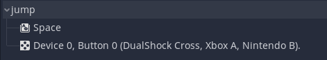
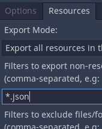

Implement key/button prompts into godot easily.
This system currently supports key prompts for:

- Keyboard and mouse
- PS4 controller
- Xbox One controller

Xbox One controller prompts will be used for controllers that are unsupported.

By the way. I didn't make these key/button prompt textures. I got them from [here](https://thoseawesomeguys.com/prompts/). If you want to help add more key/button prompts to this project, you can also get key/button prompts from there.

# Tutorial
I will now teach you how to implement the key prompt system

# For the GDScript version
1. To the side of this Github page, you should see the releases. Download the latest release.
2. Drag and rop the `Key Prompts System GDScript` folder into your game. Make sure it isn't inside of any other folders. 
3. Inside the `Key Prompts System GDScript` folder, you will see a file named `KeyPrompt.tscn`. Drag it into your level/scene.
4. Resize it if you want
5. Click on it and set the action variable.

The action variable is supposed to be set to the name of the action you want the prompt to show. For example, the `jump` action which uses the **space bar** or the **x/a button on a controller**

6. After setting the action variable, go to the [exporting section](#when-exporting) to know about what to do when exporting you're game.

# For the C# verison
1. Follow the steps of the GDScript version but instead of using `Key Prompts System GDScript` folder, use the `Key Prompts System CSharp` folder.

Now you have to install the [Newtonsoft Json.Net Nuget Package](https://www.newtonsoft.com/json).
If you're using Visual Studio Community, just use the Nuget Package Manager.
If you're using Visual Studio Code, just use [this Nuget Package extension](https://marketplace.visualstudio.com/items?itemName=jmrog.vscode-nuget-package-manager) or look for another one.

# When exporting
Add `*.json` to the resources tab

# Questions you would probably ask

### Q. How do I customize the look of the prompts?
Well.. The best and easiest way I could think of is if you just draw or add images on top of the key prompt sprite sheet that you want to customize. If you want to make an entirely different sprite sheet, you gotta edit the json files located in the `ButtonPromptTextures` folder.

### Q. Will you add more controller prompts?
Im not sure. I only have a PS4 controller...

### Q. What will my dinner be...
Idk, what do you like?

# Licensing
The key/button prompt system is free for commercial and personal uses. You can also remix and edit the code fore your personal uses.