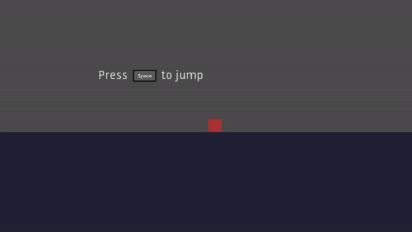

# Godot key/button prompts system

Implement key/button prompts into godot easily.
This system currently supports key prompts for keyboard and mouse, PS4 controllers, and Xbox One controllers. Xbox One controller prompts will be used for controllers that are unsupported.

# Tutorial
I will now teach you how to implement the key prompt system

# For the GDScript version
1. Drag and rop the `Key Prompts System GDScript` folder into your game. Make sure it isn't inside of any other folders. 
2. Inside the `Key Prompts System GDScript` folder, you will see a file named `KeyPrompt.tscn`. Drag it into your level/scene.
3. Resize it if you want
4. Click on it and set the action variable.

The action variable is supposed to be set to the name of the action you want the prompt to show. For example, the `jump` action which uses the **space bar** or the **x/a button on a controller**

5. After setting the action variable, you are ready to go!

# For the C# verison
1. Follow the steps of the GDScript version but instead of using `Key Prompts System GDScript` folder, use the `Key Prompts System CSharp` folder.

Now you have to install the [Newtonsoft Json.Net Nuget Package](https://www.newtonsoft.com/json).
If you're using Visual Studio Community, just use the Nuget Package Manager.
If you're using Visual Studio Code, just use [this Nuget Package extension](https://marketplace.visualstudio.com/items?itemName=jmrog.vscode-nuget-package-manager) or look for another one.

# Licensing
The key prompts system is free for commercial and personal uses. You can also remix and edit the code fore your personal uses.